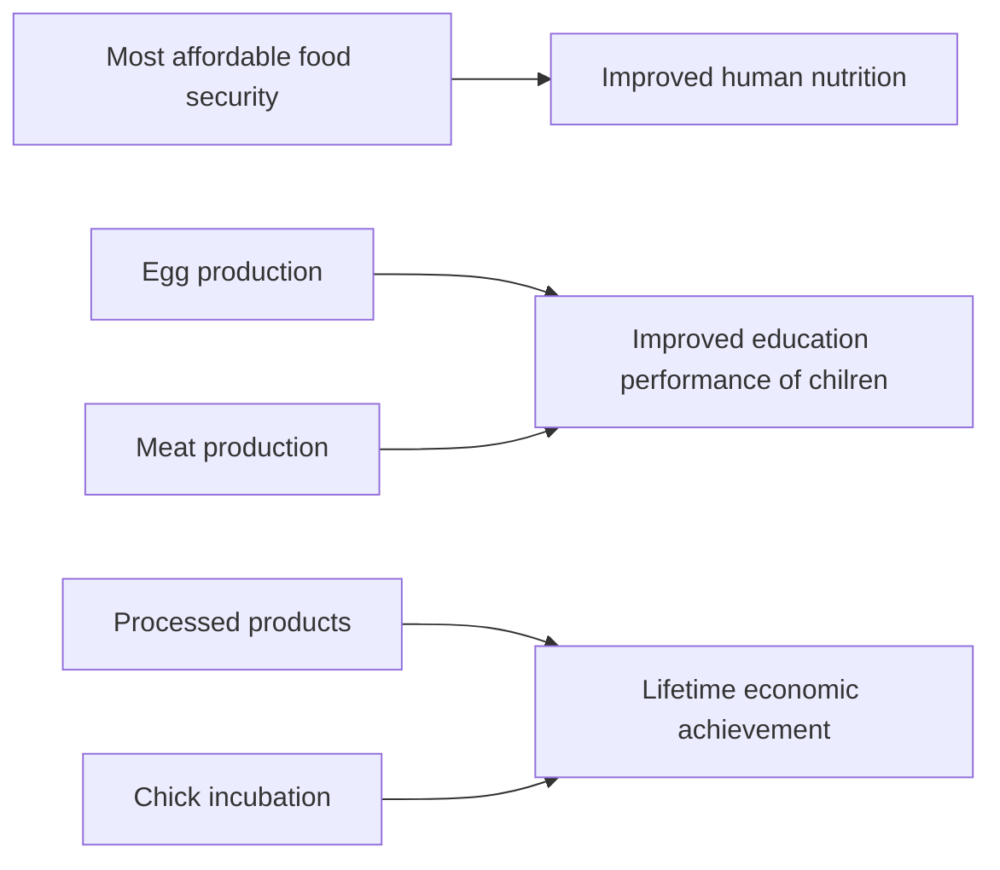

# KaPU Application 

<figure>
    
    <figcaption><b>Welcome to KaPU application </b></figcaption>
    <figcaption><b>Manage your Data, Improve Yield</b></figcaption>
</figure>

## Overview 
KaPU is an data-driven mobile application that supports smallholder poultry farmers, and extension officers. 

Smallscale chicken farmers in Tanzania are challenged with:

  * Low chicken productivity from diseases
  * Limited access to agricultural extension services
  * Inadequate biosecurity measures

At farm level in Tanzania, farmers can diagnose chicken diseases and improve their business performance using the KaPU application. 

### Chicken Matters

### KaPU App Components
#### [1. KaPU Detect](kapudetect.md) 
#### [2. KaPU Edu](kapuedu.md)
