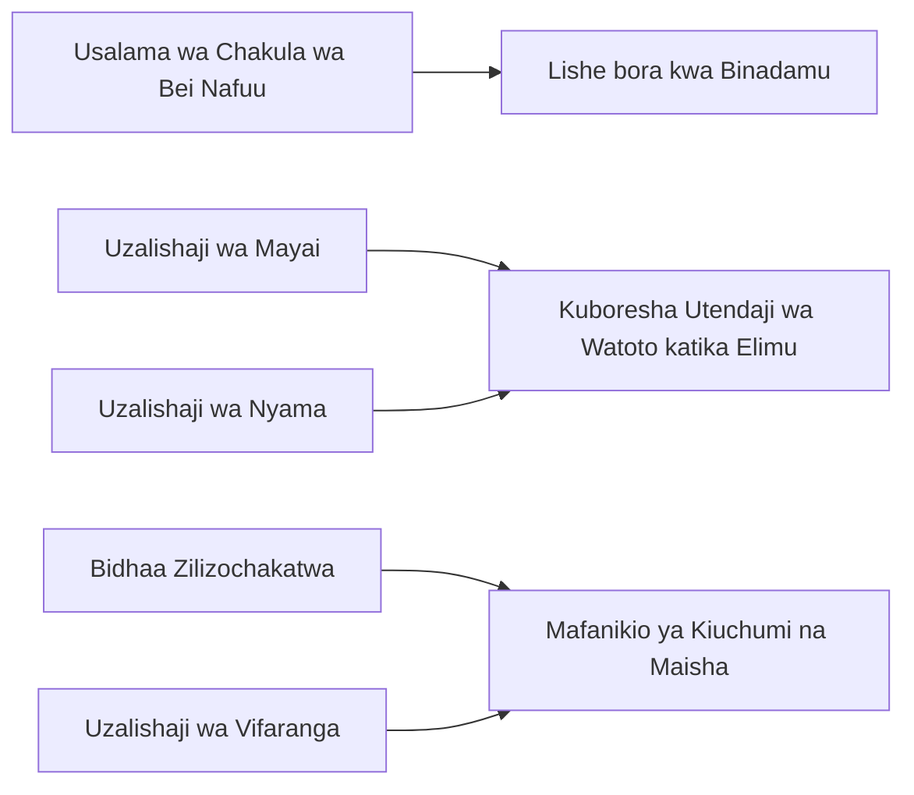

# Programu ya KaPU  

<figure>
    
    <figcaption><b>Karibu katika Programu ya KaPU </b></figcaption>
    <figcaption><b>Dhibiti Takwimu zako, Boresha Uzalishaji</b></figcaption>
</figure>

## Muhtasari 
KaPU ni programu ya simu inayotumia data kuwasaidia wakulima wadogo wa kuku na maafisa wa ugani.  

Wakulima wadogo wa kuku nchini Tanzania wanakutana na changamoto zifuatazo: 

  * Uzalishaji duni wa kuku kutokana na magonjwa 
  * Upatikanaji mdogo wa huduma za ugani 
  * Upungufu wa hatua za usalama wa kitaalamu 

Katika ngazi ya shamba nchini Tanzania, wakulima wanaweza kugundua magonjwa ya kuku na kuboresha utendaji wa biashara zao kwa kutumia programu ya KaPU.

### Umuhimu wa Kuku 

### Sehemu za Programu ya KaPU
#### [1. KaPU Chunguza](kapudetect.md) 
#### [2. KaPU Elimu](kapuedu.md)
